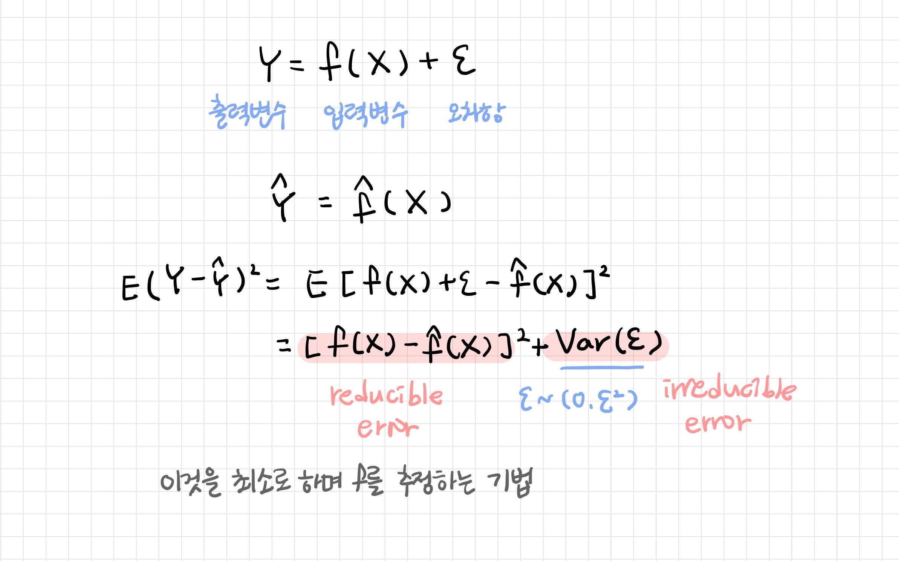
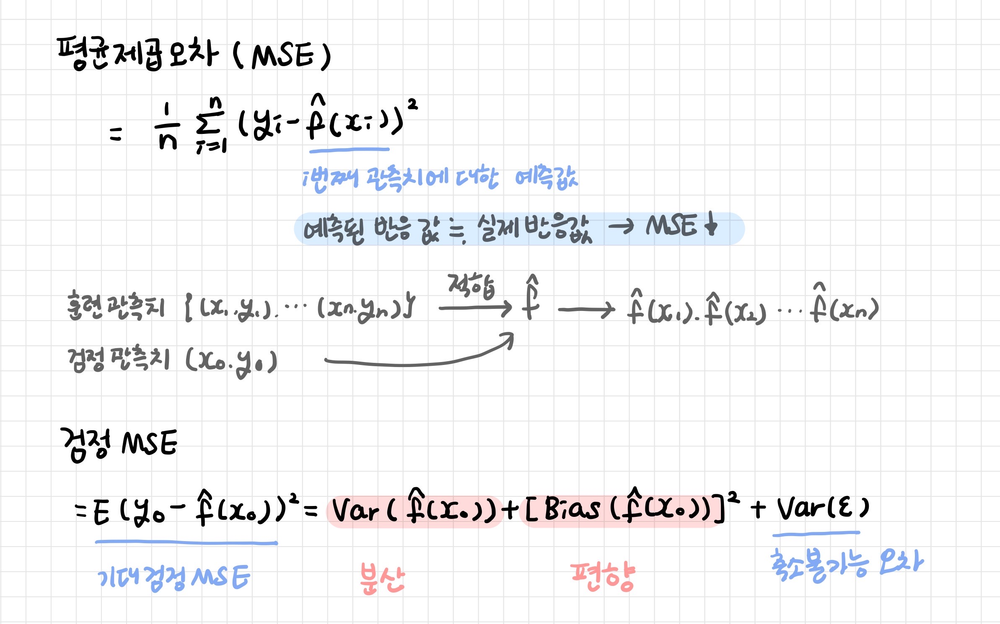
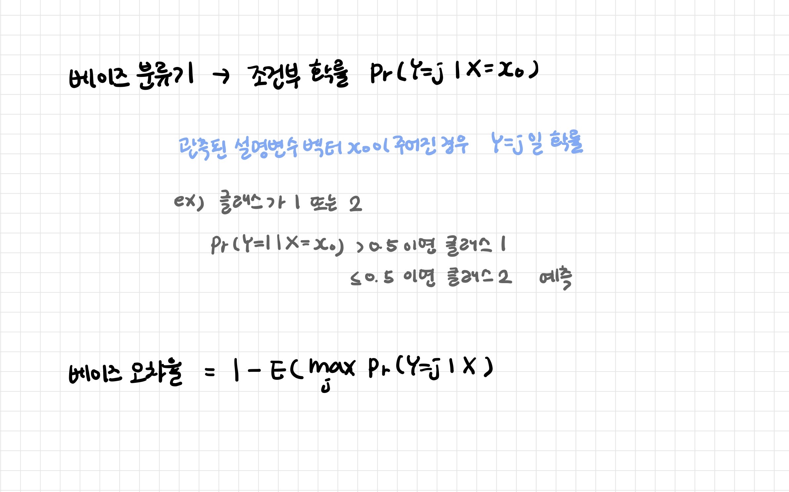
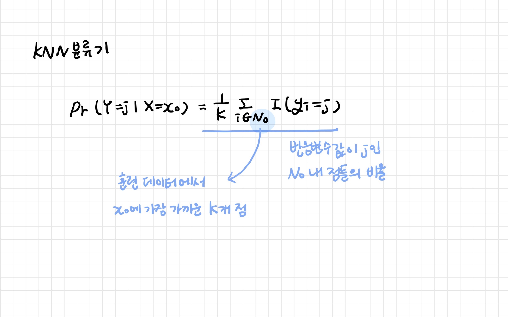

# 00_0_통계학습

[TOC]

## 1. 통계 학습

> Statistical Learning

데이터에 대한 이해를 위한 방대한 도구 집합

f를 추정하는 일련의 기법들
$$
Y = f(X) + ε
$$

- 입력 변수(input) = 설명 변수 = 예측 변수 = 독립 변수 = 특징 = 변수 (X)

- 출력 변수(output) = 반응 변수 = 응답 변수 = 종속 변수 (Y)

- 랜덤 오차항(error term): X와 독립적이며 평균 0

<br>

---

<br>

## 2. f 추정 이유

> 예측과 추론

<br>

### 2-1. 예측

X가 변함에 따라 Y가 어떻게 영향을 받는지 예측



- f_hat은 블랙 박스로 취급: f_hat이 Y에 대한 정확한 예측을 제공한다면 그것의 정확한 형태에 대해서는 신경 쓰지 않는다

- Y_hat의 정확성
  - 축소가능 오차(reducible error): 적절한 통계학습 기법을 사용하여 f를 추정함으로 f_hat의 정확성을 개선할 수 있다
  - 축소불가능 오차(irreducible error): ε과 관련된 변동성 (ε에 의해 도입된 오차는 줄일 수 없다)

<br>

### 2-2. 추론

X와 Y 사이의 관계 추론

- f_hat은 블랙 박스로 취급되지 않는다: 이제는 f_hat의 정확한 형태를 알아야한다
- 어떤 설명 변수들이 반응 변수와 관련되어 있는지
- 반응변수와 각 설명변수 사이의 상관관계
- Y와 각 설명 변수의 상관관계는 선형 방정식을 사용하여 요약될 수 있는지 혹은 더 복잡한 식을 써야하는지

<br>

```
예측: 설명변수들을 사용하여 반응변수를 정확히 예측하는 모델
추론: 개별 설명변수가 반응변수에 어떻게 영향을 미치는지
예측 + 추론
```

<br>

---

<br>

## 3. f 추정 방법

> f를 추정하는 방법

훈련 데이터 (training data): 고려 중인 방법이 f를 어떻게 추정할지 훈련시키는데 사용하는 데이터

통계 학습 방법을 훈련 데이터에 적용하여 알려지지 않은 함수 f를 추정하는 것

<br>

### 3-1. 모수적 방법

> Parametric Method; 대표적 방법은 최소제곱

1. f의 함수 형태 또는 모양에 대해 가정한다
2. 선택한 모델에 훈련 데이터를 사용하여 모델을 적합하거나 훈련시킨다 (파라미터 추정 등)

```
주의할 점
- 선택한 모델이 f의 실제 형태와 보통은 맞지 않는다
- 적합하는 모델이 유연할수록 추정해야할 파라미터 수가 많아진다: 과적합의 위험
```

<br>

### 3-2. 비모수적 방법

> Non Parametric Method

f의 함수 형태에 대한 명시적 가정 없이 데이터 포인트들에 가까워지는 f의 추정을 얻는다

```
주의할 점
- f를 추정하는 문제를 작은 수의 파라미터 추정 문제로 축소하지 않으므로 정확한 추정을 위해 많은 수의 관측치가 필요하다
```

<br>

### 3-3. 예측 정확도와 모델 해석력

예측 정확도 (유연성)과 모델 해석력의 trade off

- 덜 유연한 방법을 사용하여 더 정확한 예측을 얻거나
- 예측의 정확도는 낮더라도 가장 유연한 모델을 사용하거나

<br>

---

<br>

## 4. 지도 학습과 비지도 학습

### 4-1. 지도 학습

> Supervised

하나 이상의 입력 변수를 기반으로 출력 변수를 예측하거나 추정하는 통계적 모델을 만든다

- 설명변수를 측정한 각 관측치 xi에 대해 연관된 반응변수 yi

<br>

### 4-2. 비지도 학습

> Unsupervised

출력 변수 없이 입력 변수로 상관 관계와 구조를 파악한다

- 분석을 지도할 수 있는 반응변수가 없다: 설명변수를 측정한 각 관측치 xi

- 변수들 간 또는 관측치 간의 상관관계
- 클러스터링 분석
  - 입력변수들만 관측할 수 있고 대응하는 출력변수가 없는 경우
  - 고객에 대한 인구 통계학적 정보를 특징에 따라 그룹화하여 어느 유형의 고객들이 서로에게 유사한지를 이해

<br>

---

<br>

## 5. 회귀와 분류

### 5-1. 회귀

> Regression

연속적 (Continuous) 또는 양적 (Quantitative) 출력값 예측

양적 반응변수를 가지는 것

- 양적 변수: 수치 값을 취하는 것

- 고용인의 나이, 교육, 임금을 받은 연도 사이의 관련성 이해

<br>

### 5-2. 분류

> Classification

범주형 (Categorical) 또는 질적 (Qualitative) 출력값 예측

질적 반응변수를 가지는 것

- 질적 변수: K개의 다른 클래스 / 카테고리 중 하나의 값을 갖는 것 

- 주가지수 변동을 이용하여 주어진 날짜에 대한 주가지수의 상승 또는 하락을 예측
- 수치를 예측하는 것이 아니라 주식시장이 상승 / 하강 어디에 속할지를 예측

<br>

---

<br>

## 6. 모델 정확도 평가

### 6-1. 적합의 품질 측정

**평균제곱오차 (MSE; Mean Squared Error)**: 

주어진 관측치에 대해 예측된 반응 값이 관측치에 대한 실제 반응 값에 얼마나 가까운지를 수량화

- 훈련데이터(training data) -> **훈련 MSE**

- 검정데이터(test data) -> **검정 MSE**



- **교차검증 (Cross Validation)**: 훈련 데이터를 사용하여 검정 MSE를 추정하는 방법
- **과적합 (Overfitting)**: 훈련 MSE는 작지만 검정 MSE는 큰 경우

```
모델의 유연성↑ -> 훈련 MSE↓ (단조감소)
모델의 유연성↑ -> 검정 MSE↓ 하다가 ↑ (U모양)
```

<br>

### 6-2. 편향-분산 절충

**분산**: 다른 훈련 데이터를 사용하여 추정하는 경우 예측한 모델이 변동되는 정도

**편향**: 실제 문제를 훨씬 단순한 모델로 근사시킴으로 인해 발생하는 오차

```
모델의 유연성↑ -> 분산↑ 편향↓
```

```
유연성 증가 초반: 편향의 감소 > 분산의 증가
유연성 증가 이후: 편향의 감소 < 분산의 증가
```

<br>

### 6-3. 분류 설정

**훈련오차율 (Training Error Rate)**

**검정오차율 (Test Error Rate)**


**지시변수 (Indicator Variable)**: 예측된 관측치가 실제 관측치와 같다면 1, 같지 않다면 0

```
주어진 설명변수 값에 대해 가장 가능성이 높은 클래스에 각 관측치를 할당하는 분류기에서 검정 오차율이 최소가 된다
-> 베이즈 분류기
```

<br>

**1. 베이즈분류기 (Bayes Classifier)**: 조건부 확률에 따른 분류기



**2. K-최근접 이웃 (K-Nearest Neighbors)**: X에 대한 Y의 조건부분포를 추정하여 가장 높은 추정 확률을 가지는 클래스로 관측치를 분류



```
모델의 유연성↑ -> 훈련오차율↓ (단조감소)
모델의 유연성↑ -> 검정오차율↓ 하다가 ↑ (U모양)
```

