# 1_단순 선형 회귀

> Simple Linear Regression

종속변수를 하나의 독립변수로 설명

[TOC]


<br>

---

<br>

## 1. 모델 생성

### 1-1. 계수추정

**최소제곱추정법 (LSE; Least Square Estimation Method)**

오차의 제곱 합이 최소가 되도록 회귀 계수를 추정하는 방법

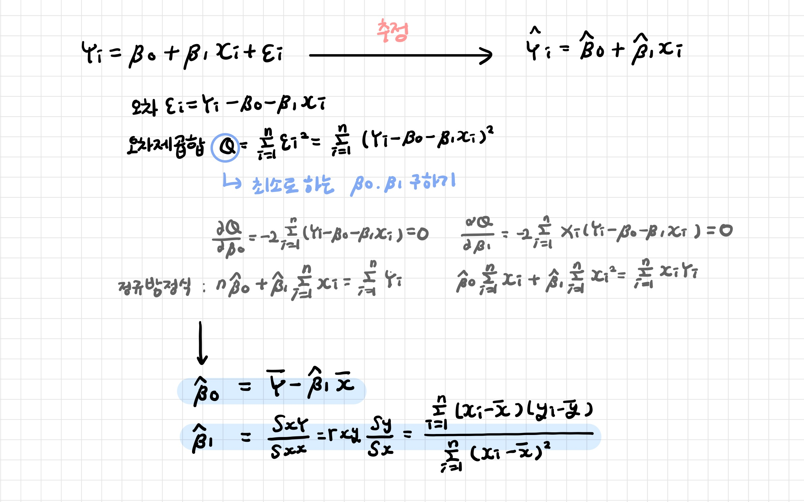

<br>

### 1-2. 선형 회귀 결과

> 주행속도와 제동거리 간의 선형 회귀 모델 추정
>
> dist = -17.579 + 3.932 x speed

```r
> m <- lm(dist ~ speed, cars)
> m

Call:
lm(formula = dist ~ speed, data = cars)

Coefficients:
(Intercept)        speed  
    -17.579        3.932 
```

- **회귀계수** `coef(model)`

```r
> coef(m)
(Intercept)       speed 
 -17.579095    3.932409 
```

- **적합된 값** `fitted(model)`: 모델에 의해 예측된 값

```r
> fitted(m)[1:4]
        1         2         3         4 
-1.849460 -1.849460  9.947766  9.947766 
```

- **잔차** `residuals(model)`: 모델로부터 구한 예측값과 실제 값 사이의 차이


```r
> residuals(m)[1:4]
        1         2         3         4 
 3.849460 11.849460 -5.947766 12.052234 
```

- **회귀계수의 신뢰구간** `confint(model)`: t 분포를 사용한 신뢰구간

```r
> confint(m)
                 2.5 %    97.5 %
(Intercept) -31.167850 -3.990340
speed         3.096964  4.767853
```

- **잔차 제곱 합 (RSS; Residual Sum of Square)** `deviance` : 실제 데이터와 선형 회귀 모델의 적합된 값의 차이의 제곱 합 → 데이터와 추정된 모델 간의 불일치 정도

```r
> deviance(m)
[1] 11353.52
```

<br>

```r
> plot(cars$speed, cars$dist)
> abline(coef(m))
```


```r
> speed <- seq(min(cars$speed), max(cars$speed), .1)
> ys <- predict(m, newdata=data.frame(speed=speed), interval="confidence")
# 선형회귀식
> matplot(speed, ys, type='n')
# 신뢰구간
> matlines(speed, ys, lty=c(1, 2, 2), col=1)
```

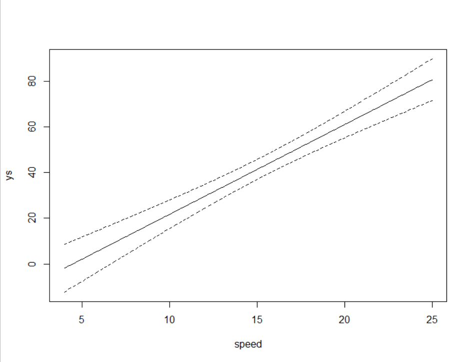

<br>

---

<br>

## 2. 분산분석

**제곱합 분해 (Decomposition)**

- **SST (Total Sum of Square)**: 총 제곱합

- **SSR (Regression Sum of Square)**: 회귀 제곱합

- **SSE (Error Sum of Square)**: 오차 제곱합

| 변동요인 | 제곱합 (SS) | 자유도 | 평균제곱 (MS)     | 검정 통계량   |
| -------- | ----------- | ------ | ----------------- | ------------- |
| **회귀** | SSR         | 1      | MSR = SSR / 1     | F = MSR / MSE |
| **잔차** | SSE         | n-2    | MSE = SSE / (n-2) |               |
| **합계** | SST         | n-1    |                   |               |

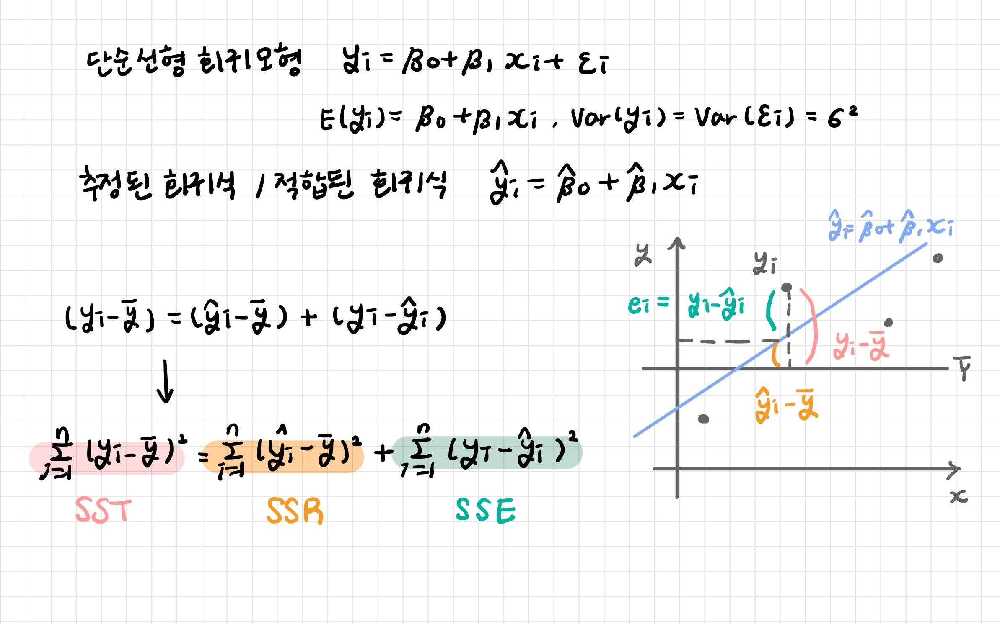

```r
> anova(m)
Analysis of Variance Table

Response: dist
          Df Sum Sq Mean Sq F value   Pr(>F)    
speed      1  21186 21185.5  89.567 1.49e-12 ***
Residuals 48  11354   236.5                     
---
Signif. codes:  0 ‘***’ 0.001 ‘**’ 0.01 ‘*’ 0.05 ‘.’ 0.1 ‘ ’ 1
```

> 완전 모델과 축소 모델 비교
>
> - full: 설명 변수 speed로 dist를 예측
> - reduced: 설명 변수 speed를 제외하고 dist를 상수값으로 예측
>
> F 통계량 = 89.567, p-value = 1.49e-12 *** -> reduced 모델과 full 모델 간에는 유의한 차이가 있다 -> speed 열이 유의미한 변수이다

```r
> full <- lm(dist ~ speed, data=cars)
> full

Call:
lm(formula = dist ~ speed, data = cars)

Coefficients:
(Intercept)        speed  
    -17.579        3.932  

> reduced <- lm(dist ~ 1, data=cars)
> reduced

Call:
lm(formula = dist ~ 1, data = cars)

Coefficients:
(Intercept)  
      42.98  
```

```r
> anova(reduced, full)
Analysis of Variance Table

Model 1: dist ~ 1
Model 2: dist ~ speed
  Res.Df   RSS Df Sum of Sq      F   Pr(>F)    
1     49 32539                                 
2     48 11354  1     21186 89.567 1.49e-12 ***
---
Signif. codes:  0 ‘***’ 0.001 ‘**’ 0.01 ‘*’ 0.05 ‘.’ 0.1 ‘ ’ 1
```

<br>

---

<br>

## 3. 회귀모형 검정

회귀계수(기울기) 유의성 검정

<br>

### 3-1. t 검정


<br>

### 3-2. F 검정

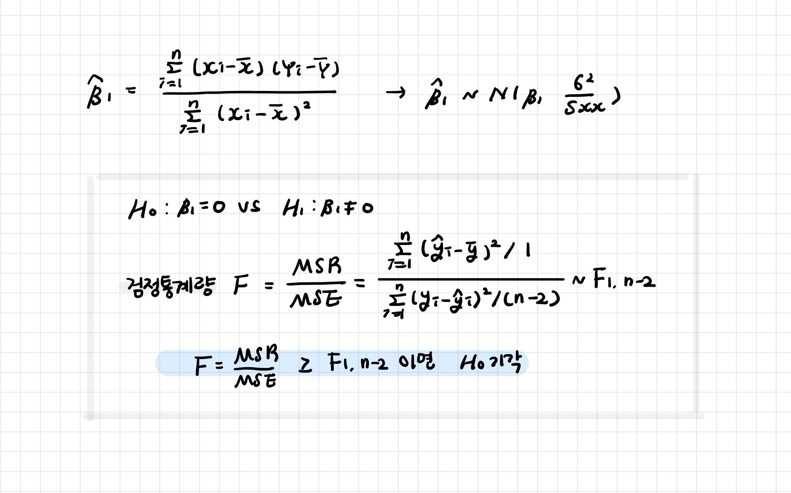

<br>

---

<br>

## 4. 회귀모형 평가

귀무가설을 기각하고 대립가설을 채택했다면 모델이 데이터에 적합한 정도를 평가해야한다


<br>

### 4-1. 잔차표준오차 (RSE)

- 적합성 결여 (lack of fit)의 판단 기준

- 오차항의 표준편차에 대한 추정값

- 반응변수 값이 실제 회귀선으로부터 벗어나게 될 평균값

```
RSE가 작으면 모델이 데이터를 잘 적합한다는 의미
RSE가 크면 모델이 데이터를 잘 적합하지 않는다는 의미
```

<br>

### 4-2. 결정계수 (R2)

- 모델의 적합성 (goodness of fit) 판단 기준

- 설명된 분산의 비율: 회귀 모델이 데이터를 얼마나 잘 설명해주느냐를 나타내는 측도
- 설명력: 전체 변동 중 회귀 직선에 의해 설명할 수 있는 변동이 차지하는 비율

```
R^2이 1에 가까울수록 추정된 회귀식이 총변동량의 많은 부분 설명한다는 의미
R^2이 0에 가까울수록 추정된 회귀식이 총변동량을 적절하게 설명하지 못한다는 의미
```

<br>

```r
> summary(m)

Call:
lm(formula = dist ~ speed, data = cars)

Residuals:
    Min      1Q  Median      3Q     Max 
-29.069  -9.525  -2.272   9.215  43.201 

Coefficients:
            Estimate Std. Error t value Pr(>|t|)    
(Intercept) -17.5791     6.7584  -2.601   0.0123 *  
speed         3.9324     0.4155   9.464 1.49e-12 ***
---
Signif. codes:  0 ‘***’ 0.001 ‘**’ 0.01 ‘*’ 0.05 ‘.’ 0.1 ‘ ’ 1

Residual standard error: 15.38 on 48 degrees of freedom
Multiple R-squared:  0.6511,	Adjusted R-squared:  0.6438 
F-statistic: 89.57 on 1 and 48 DF,  p-value: 1.49e-12
```

- `Residuals`: 실제 데이터에서 관측된 잔차
- `Coefficients`: 모델의 계수와 계수들의 통계적 유의성
- `Multiple R-squared`과 `Adjusted R-squared`: 모델이 데이터의 분산을 얼마나 설명하는지
- `F-statistic`: 모델이 통계적으로 얼마나 의미가 있는지

<br>

---

<br>

## 5. 예측

모델을 만들고 나면 새로운 데이터에 대한 예측값을 구할 수 있다

> 자동자 주행속도와 제동거리에 대한 선형 회귀모델을 사용해 주행속도가 3인 경우의 제동거리 예측해보기

```r
> m <- lm(dist ~ speed, cars)
> predict(m, newdata=data.frame(speed=3))
        1 
-5.781869 
```

```r
> coef(m)
(Intercept)       speed 
 -17.579095    3.932409 

> -17.579095 + 3.932409 * 3
[1] -5.781868
```

<br>

### 5-1. 평균값 예측과 신뢰구간


> 특정 속도를 가진 평균적인 차량의 제동 거리

```r
> predict(m, newdata=data.frame(speed=3), interval="confidence")
        fit       lwr      upr
1 -5.781869 -17.02659 5.462853
```

<br>

### 5-2. 개별값 예측과 예측구간

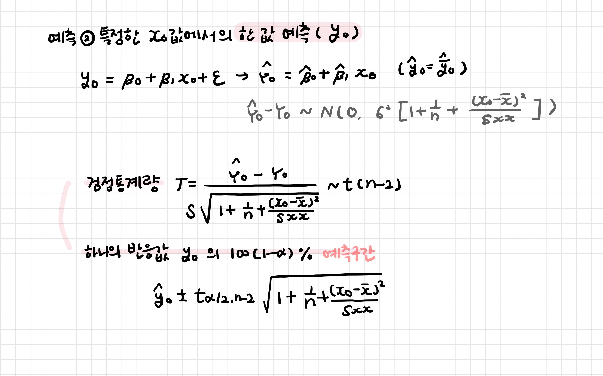

> 특정 속도를 가진 차량 한대의 제동거리

```r
> predict(m, newdata=data.frame(speed=3), interval="prediction")
        fit       lwr      upr
1 -5.781869 -38.68565 27.12192
```

<br>

---

<br>

## 6. 모델 진단

### 6-1. 모형의 선형성

- 진단: 잔차 산점도가 선형인지 확인

- 처방: 비선형회귀모형을 설정하거나 변수변환을 하여 선형이 되도록 하기

<br>

### 6-2. 잔차 진단

잔차(residuals): 남아있는 오차, 추정 회귀식이 반응변수 관찰치를 설명하지 못하는 부분

- 잔차 산점도 (Residual Plot)를 그렸을 때 평평한 띠 모양

- 오차항에 대한 가정 검토: 독립성, 정규성, 등분산성

**1. 오차의 등분산성**

- 진단: 잔차 산점도에서 띠 모양이 나오는지 확인

- 처방: 등분산이 되도록 모형을 조정하거나 이분산을 고려한 모형으로 바꾸기

**2. 오차의 정규성**

- 진단: 잔차의 히스토그램, 줄기잎그림을 그려 정규 분포 모양인지 확인
  - Shapiro-Wilk W 통계량
  - `Normal Q-Q plot`
- 처방: 변수변환을 하기

**3. 오차의 독립성**

- 진단: Durbin-watson 통계량

<br>

### 6-3. 이상치

- 입력 실수인지 확인
- 이상치를 그대로 포함할지, 제거한 후 선형 모형을 적용할지 확인

<br>

### 6-4. 영향관찰치

- 입력 실수인지 확인

- 영향력을 판단하기 위해 제거한 후 모형을 추정하고 추정치 값들과 R2가 얼마나 차이나는

<br>

```r
plot(m)
```

`Residuals vs Fitted plot`

- X축 - 선형 회귀로 예측된 Y값, Y축 - 잔차

- 0에서 멀리 떨어진 값: 이상치 가능

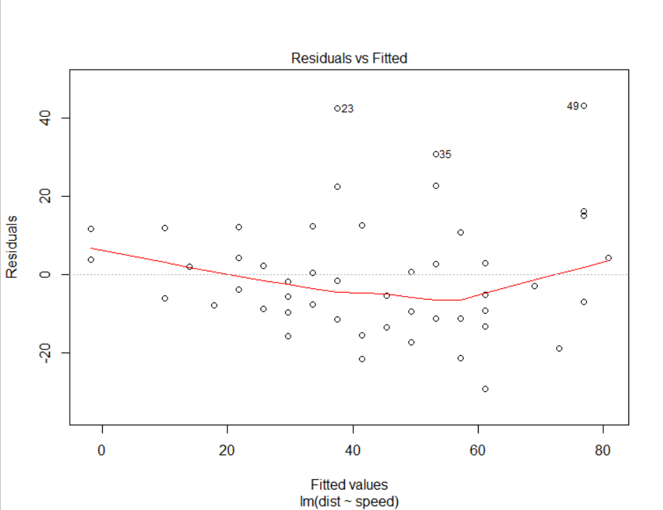

`Normal Q-Q plot`

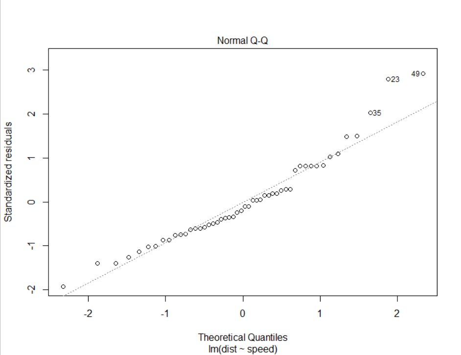

`Scale-Location plot`

- X축 - 선형 회귀로 예측된 Y값, Y축 - 표준화 잔차
- 0에서 멀리 떨어진 값: 이상치 가능

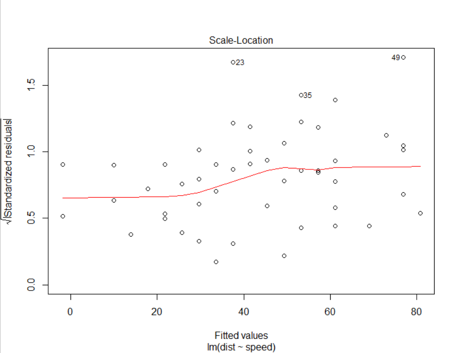

`Residuals vs Leverage plot`

- X축 - 레버리지, Y축 - 표준화 잔차

- 레버리지: 설명변수가 얼마나 극단에 치우쳐 있는지
- 쿡의 거리 (Cook's Distance): 회귀 직선의 모양에 크게 영향을 끼치는 점들을 찾는 방법으로, 레버리지와 잔차에 비례 (우측 상단, 우측 하단)

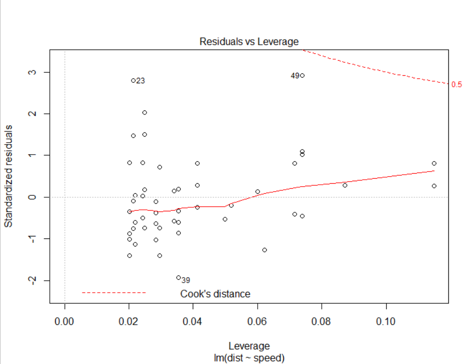

<br>

```r
plot(m, which=c(4, 6))
```

`Cook's distance`

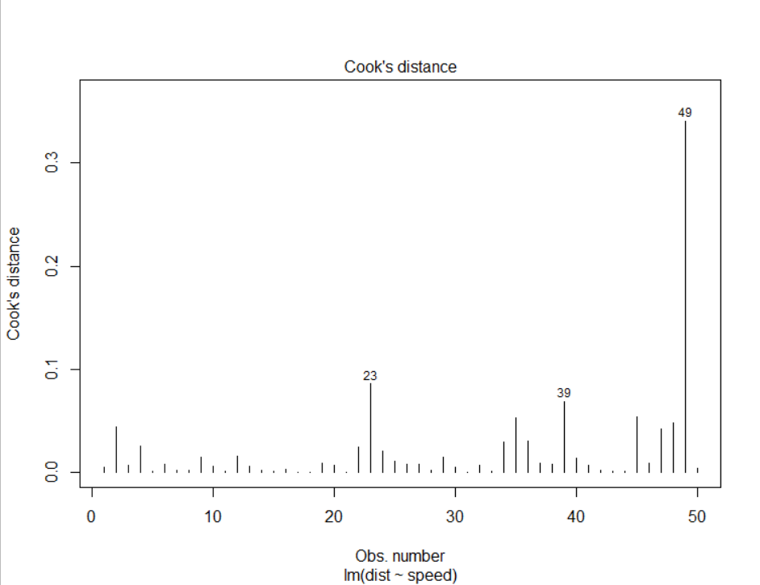

`Cook's dist vs Leverage`

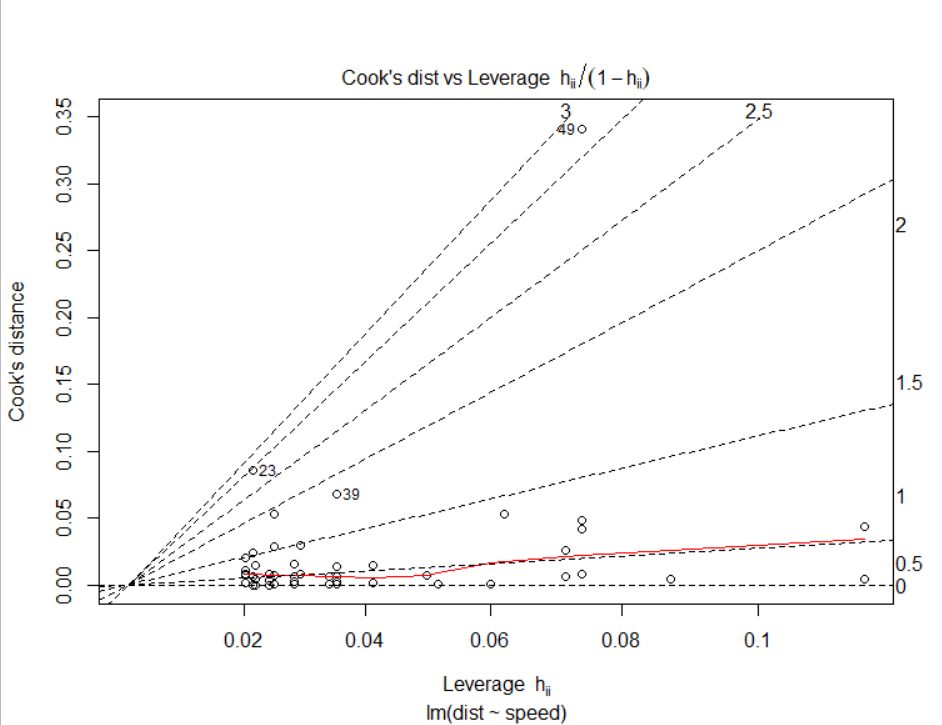
