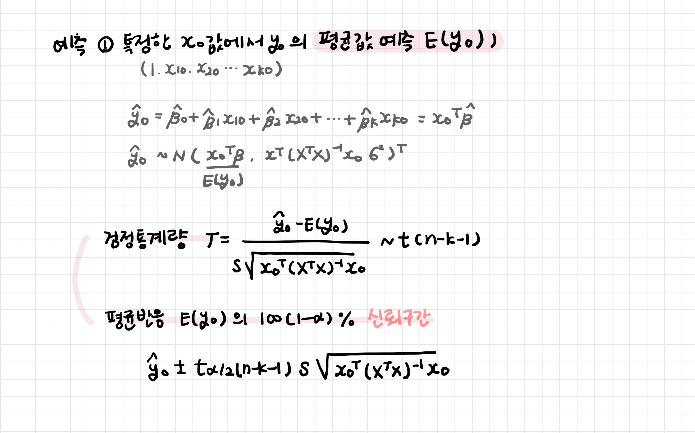

# 2_다중 선형 회귀

> Multiple Linear Regression

종속변수를 두 개 이상의 독립변수로 설명

[TOC]

 

---

 

## 1. 모델 생성

### 1-1. 계수 추정

**최소제곱추정법 (LSE; Least Square Estimation Method)**

오차의 제곱 합이 최소가 되도록 회귀 계수를 추정하는 방법

 

### 1-2. 선형 회귀 결과

 

---

 

## 2. 제곱합 분해 

### 2-1. Decomposition

- **SST (Total Sum of Square)**: 총 제곱합
- **SSR (Regression Sum of Square)**: 회귀 제곱합
- **SSE (Error Sum of Square)**: 오차 제곱합

 

### 2-2. 분산분석표 (ANOVA)

| 변동요인 | 제곱합 (SS) | 자유도 | 평균제곱 (MS)       | 검정 통계량   |
| -------- | ----------- | ------ | ------------------- | ------------- |
| **회귀** | SSR         | k      | MSR = SSR / k       | F = MSR / MSE |
| **잔차** | SSE         | n-k-1  | MSE = SSE / (n-k-1) |               |
| **합계** | SST         | n-1    |                     |               |

 

---

 

## 3. 회귀모형 검정

### 3-1. 회귀식의 유의성 검정

반응변수와 설명변수 사이에 상관관계가 있는지

 

### 3-2. 개별 계수의 유의성 검정

 

---

 

## 4. 회귀모형 평가

귀무가설을 기각하고 대립가설을 채택했다면 모델이 데이터에 적합한 정도를 평가해야한다

 

---

 

## 5. 예측

### 5-1. 평균값 예측과 신뢰구간

 

### 5-2. 개별값 예측과 예측구간

