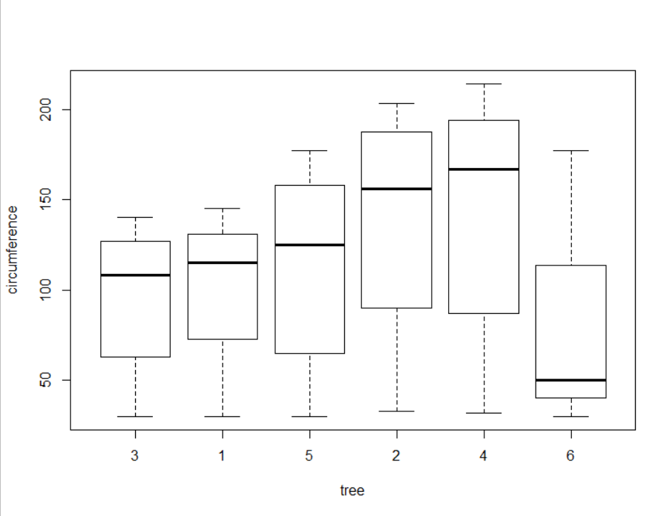
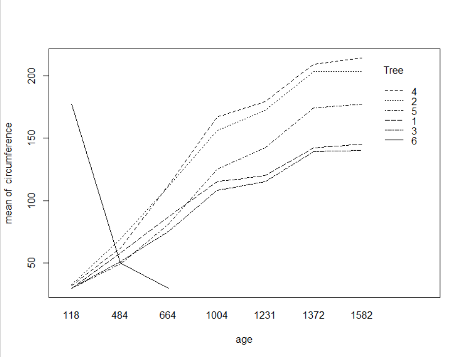

# 6_상호작용

> interaction

- 독립변수 간의 상호작용이 종속 변수에 영향을 주는 경우

- 영향을 주는 방법이 합이 아니라 곱의 형태일 때

<br>

`(X + Y) ^ 2 = X + Y + X:Y`

`I((X + Y)^2) = (X + Y) ^ 2`

> Orange 데이터에서 Tree와 circumference 간 상호 연관 관계 시각화

```r
> with(Orange, plot(Tree, circumference, xlab="tree", ylab="circumference"))
```



<br>

> 상호작용 그래프: age, Tree의 상호작용이 circumference에 어떤 영향을 주는지
>
> - Tree의 age가 높아짐에 따라 circumference가 길어지는 추세
> - 어떤 Tree인가에 따라 age와 circumference의 관계는 서로 다르다

```r
> with(Orange, interaction.plot(age, Tree, circumference))
```



> fTree, age, fTree:age를 설명 변수로 선형 회귀 수행
>
> fTree, age 두 설명 변수 모두 p-value < 0.05 이므로 H0 기각 -> 유의하다
>
> 둘의 상호작용인 fTree:age의 p-value < 0.05이므로 H0 기각 -> 유의하다

```r
> Orange[,"fTree"] <- factor(Orange[, "Tree"], ordered=FALSE)
> m <- lm(circumference ~ fTree * age, data=Orange)
> anova(m)
Analysis of Variance Table

Response: circumference
          Df Sum Sq Mean Sq F value    Pr(>F)    
fTree      5  14359    2872  23.111 8.276e-09 ***
age        1  83158   83158 669.192 < 2.2e-16 ***
fTree:age  5  26849    5370  43.212 8.751e-12 ***
Residuals 26   3231     124                      
---
Signif. codes:  0 ‘***’ 0.001 ‘**’ 0.01 ‘*’ 0.05 ‘.’ 0.1 ‘ ’ 1
```

