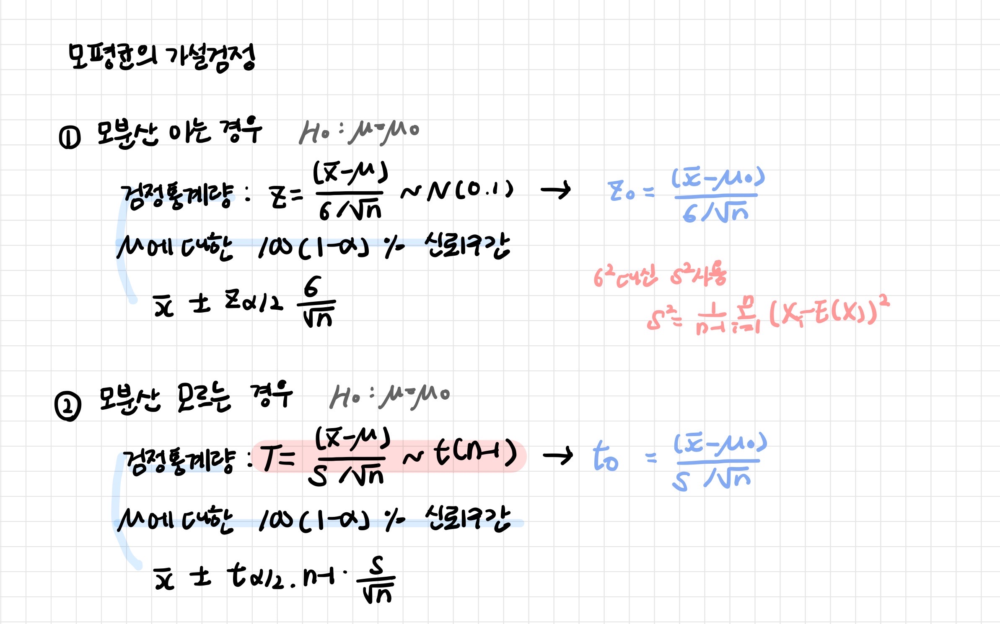
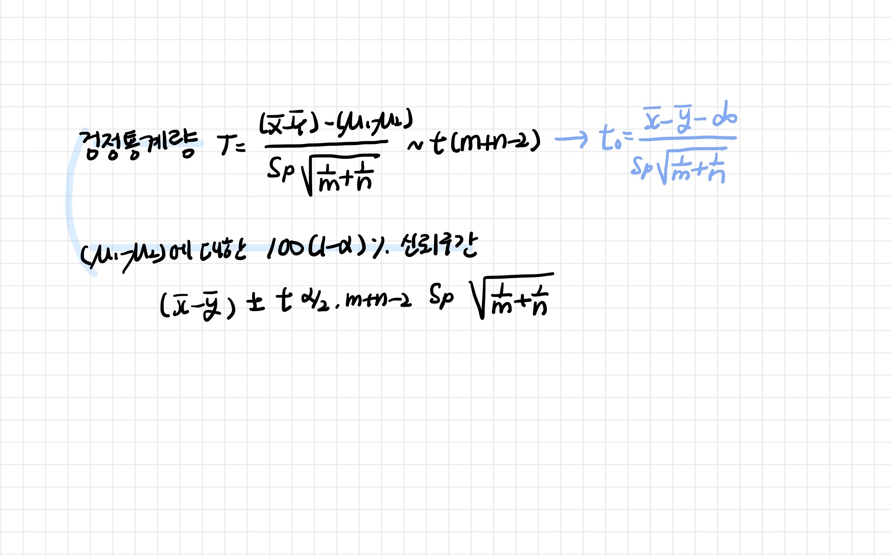
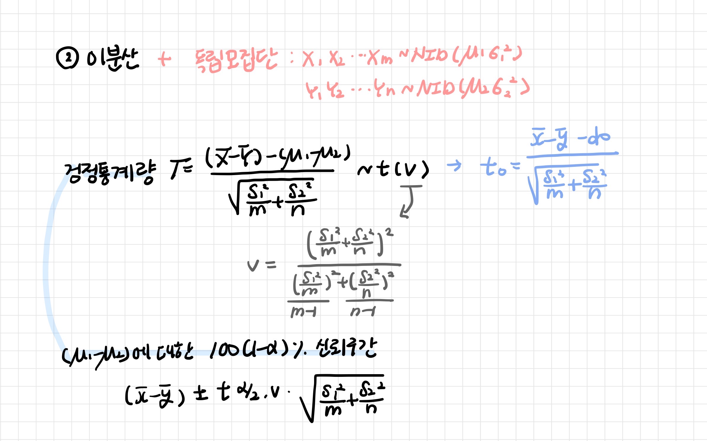
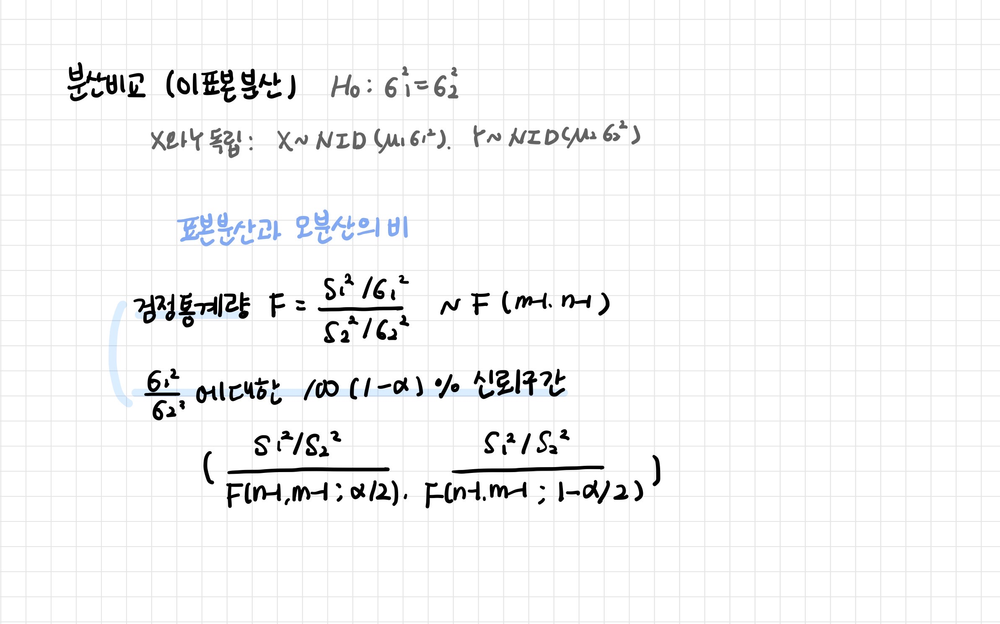

# 2_추정 및 검정

> 평균, 분산, 비율에 대해 추정하고 검정하는 방법

[TOC]

**추정**: 분포를 가정하여 통계적 이론에 의해 주어진 신뢰 수준에 해당하는 신뢰 구간을 구한다

**가설 검정**: 귀무가설이 옳다면 수집된 데이터는 귀무가설 하에서는 나오기 힘든 비정상적인 자료라는 것을 보이는 것

- 귀무가설 하에서 검정 통계량의 확률 분포를 이용하여 표본이 귀무가설 하에서 정상적인 자료라고 할 수 있는지, 비정상적인 자료라고 할 수 있는지 판정

- 주어진 `α`를 고정시키고 이를 만족시키는 기각역 중 `β`를 최소로 하는 기각역 선택

**검정 통계량**: 검정에 사용하기 위하여 표본 자료에서 구한 통계량 (판단의 기준)

**검정 오류**

|           | H0 기각 X         | H0 기각 O                |
| --------- | ----------------- | ------------------------ |
| **H0 참** | 올바른 판단 `1-α` | 제 1종 오류 `유의수준 α` |
| **H1 참** | 제 2종 오류 `β`   | 올바른 판단 `검정력 1-β` |

**임계값 (Critical Value)**: 귀무가설의 기각 여부를 결정하는 기준치

**기각역 (Critical Region)**: 귀무가설을 기각하게 되는 데이터의 관측 영역

**유의수준 (Significance Level)**: 제 1종 오류를 범할 확률의 최대 허용 한계치

**유의확률 (Siginificance Probability) = p-value**: 귀무가설이 참일 때 표본이 대립 가설의 방향으로 검정 통계량의 값보다 더 극단적으로 나올 확률 

```
p-value < 유의수준 α : 제 1종 오류를 범할 확률이 최대 허용 한계치보다 작다면 기각해도 된다 
```

<br>

**기각역을 이용한 가설검정의 단계**

```
1. 가설 설정
2. 검정통계량과 귀무가설 하에서의 검정통계량의 분포 파악
3. 검정통계량 값 계산
4. 주어진 유의수준으로 임계값을 찾고 임계값으로 기각역을 찾는다
5. 검정통계량의 값이 기각역에 들어가면 귀무가설 기각
```

**p-value을 이용한 가설검정의 단계**

```
1. 가설 설정
2. 검정통계량과 귀무가설 하에서의 검정통계량의 분포 파악
3. 검정통계량 값 계산
4. p-value 계산
5. p-value < α 이면 귀무가설 기각
```

**신뢰구간을 이용한 가설검정의 단계**

```
1. 가설 설정
2. 신뢰구간 구하기
3. 귀무가설 하의 모수의 값이 신뢰구간 안에 들어가지 않으면 귀무가설 기각
```

<br>

---

<br>

## 1. 모평균의 가설검정

일표본 평균: 하나의 모집단으로부터 표본을 추출하고 표본으로부터 모집단 평균의 신뢰 구간을 구한다

| 모분산을 아는 경우 | 모분산을 모르는 경우 |
| ------------------ | -------------------- |
| -                  | t - test             |



>정규분포 N(10, 1)에서 30개의 표본을 뽑아 모평균의 구간을 추정 H0: μ = 10
>
>표본 평균 =  9.984331, 신뢰구간 = (9.630287, 10.338375)
>
>p-value = 0.9285 > 0.05 이고 신뢰구간이 10을 포함하므로 귀무가설 기각 X

```r
> x <- rnorm(30, mean=10)
> t.test(x, mu=10)

	One Sample t-test

data:  x
t = -0.090515, df = 29, p-value = 0.9285
alternative hypothesis: true mean is not equal to 10
95 percent confidence interval:
  9.630287 10.338375
sample estimates:
mean of x 
 9.984331 
```

<br>

---

<br>

## 2. 두 모집단 비교

### 2-1. 독립모집단

- 두 모집단에서 각각 표본을 추출한 뒤 표본으로부터 두 모집단의 평균이 같은지 확인
- 서로 독립인 두 개의 표본 집단

| 모분산을 아는 경우 | 모분산을 모르는 경우                                         |
| ------------------ | ------------------------------------------------------------ |
| -                  | F 검정 (두 모분산 비의 추론)으로 두 모분산이 같은지 확인<br>- **등분산**: 두 모분산이 같으면 합동 표본분산<br>- **이분산**: 각각의 표본분산 사용 |






> 수면제별 수면시간 증가량 데이터
>
> var.test: p-value = 0.7427 > 0.05 이므로 귀무가설 기각 X -> 두 분산이 같다고 볼 수 있다 `var.equal=TRUE`
>
> t.test: p-value = 0.07919 > 0.05 이므로 귀무가설 기각 X -> 모평균에 차이가 없다고 볼 수 있다 

```r
> sleep2 <- sleep[, -3]
> tapply(sleep2$extra, sleep2$group, mean)
   1    2 
0.75 2.33 
```

```r
> var.test(extra ~ group, sleep2)

	F test to compare two variances

data:  extra by group
F = 0.79834, num df = 9, denom df = 9, p-value = 0.7427
alternative hypothesis: true ratio of variances is not equal to 1
95 percent confidence interval:
 0.198297 3.214123
sample estimates:
ratio of variances 
         0.7983426 
```

```r
> t.test(extra ~ group, data=sleep2, paired=FALSE, var.equal=TRUE)

	Two Sample t-test

data:  extra by group
t = -1.8608, df = 18, p-value = 0.07919
alternative hypothesis: true difference in means is not equal to 0
95 percent confidence interval:
 -3.363874  0.203874
sample estimates:
mean in group 1 mean in group 2 
           0.75            2.33 
```

<br>

### 2-2. 종속모집단

짝지은 이표본 평균: 표본을 추출할 때 연관된 것끼리 짝을 지어 데이터를 추출하는 경우

> p-value = 0.002833 < 0.05 이므로 귀무가설 기각 -> 모평균의 차이가 0이라고 볼 수 없다 -> 두 수면제의 수면 시간 증가 정도가 다르다


```r
> with(sleep, t.test(extra[group==1], extra[group==2], paired=TRUE))

	Paired t-test

data:  extra[group == 1] and extra[group == 2]
t = -4.0621, df = 9, p-value = 0.002833
alternative hypothesis: true difference in means is not equal to 0
95 percent confidence interval:
 -2.4598858 -0.7001142
sample estimates:
mean of the differences 
                  -1.58 
```

<br>

---

<br>

## 3. 분산 비교

두 모집단으로부터의 표본으로부터 분산을 구해 두 모집단의 분산이 동일한지 확인



> p-value = 3.595e-14 < 0.05 이므로 귀무가설 기각: 모분산에 차이가 없다고 볼 수 없다 (ratio!=1)

```r
> with(iris, var.test(Sepal.Width, Sepal.Length))

	F test to compare two variances

data:  Sepal.Width and Sepal.Length
F = 0.27706, num df = 149, denom df = 149, p-value = 3.595e-14
alternative hypothesis: true ratio of variances is not equal to 1
95 percent confidence interval:
 0.2007129 0.3824528
sample estimates:
ratio of variances 
         0.2770617 
```

<br>

---

<br>

## 4. 모비율의 가설검정 

모집단에서 표본을 추출하여 그 표본에서 계산한 비로부터 모집단의 비를 추정 및 가설 검정


> 동전 100번 던져서 앞면이 42번 나왔을 때 앞면이 나오는 비율이 50%인지 확인
>
> p-value = 0.1336 > 0.05 이므로 귀무가설 기각 X -> 앞면이 나오는 비율이 50%라고 할 수 없다

**이항분포의 정규분포근사**

```r
> prop.test(42, 100)

	1-sample proportions test with continuity correction

data:  42 out of 100, null probability 0.5
X-squared = 2.25, df = 1, p-value = 0.1336
alternative hypothesis: true p is not equal to 0.5
95 percent confidence interval:
 0.3233236 0.5228954
sample estimates:
   p 
0.42 
```

**이항분포를 정규분포로 근사하지 않고 그대로 사용**

```r
> binom.test(42, 100)

	Exact binomial test

data:  42 and 100
number of successes = 42, number of trials = 100, p-value = 0.1332
alternative hypothesis: true probability of success is not equal to 0.5
95 percent confidence interval:
 0.3219855 0.5228808
sample estimates:
probability of success 
                  0.42 
```

<br>

---

<br>

## 5. 두 모비율 비교

두 집단에서 표본을 추출해 표본의 비율을 보고 모집단에서의 비율을 비교하는 경우


> 두 개의 동전을 각각 100, 90번 던졌을 때 앞면이 45, 55회 나왔다고 할 때, 두 동전의 앞면이 나올 확률이 같은지 검정
>
> p-value = 0.03796 < 0.05 이므로 귀무가설 기각 -> 두 동전의 앞면이 나올 확률이 같다고 볼 수 없다 -> 두 동전의 앞면이 나올 확률은 서로 다르다 

```r
> prop.test(c(45, 55), c(100, 90))

	2-sample test for equality of proportions with continuity correction

data:  c(45, 55) out of c(100, 90)
X-squared = 4.3067, df = 1, p-value = 0.03796
alternative hypothesis: two.sided
95 percent confidence interval:
 -0.31185005 -0.01037217
sample estimates:
   prop 1    prop 2 
0.4500000 0.6111111 
```

