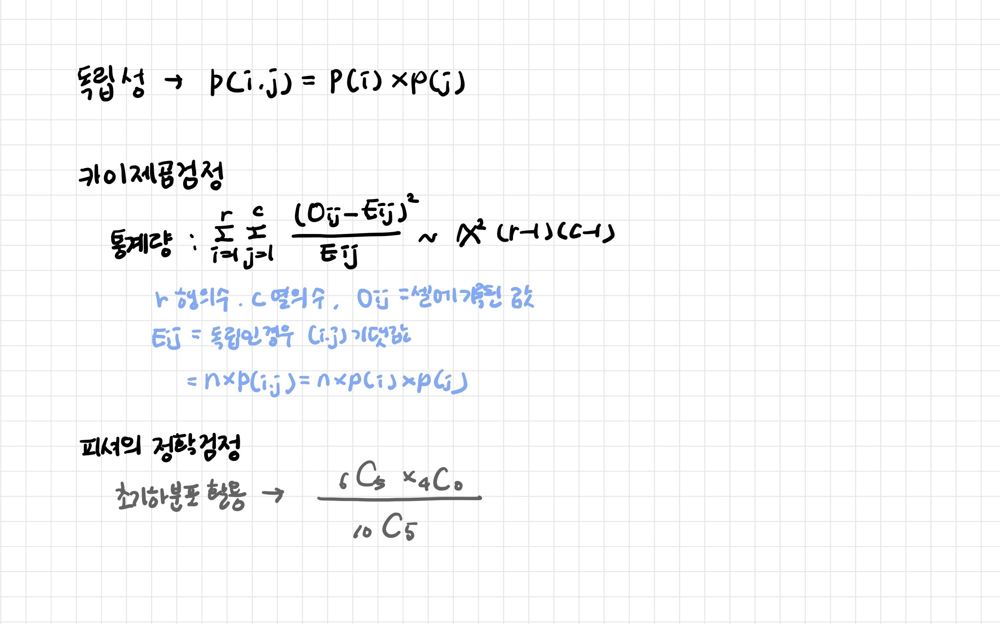
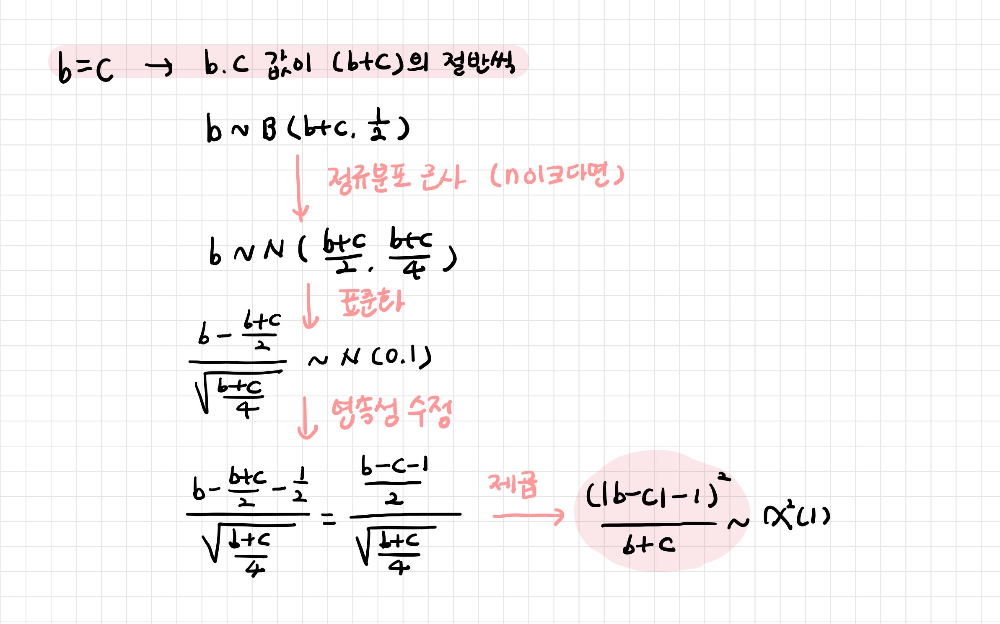

# 1_독립성 검정

[TOC]

## 1. 독립성 검정

두 사건이 서로 영향을 주고 받지 않는지 확인

> 학생들의 성별에 따른 운동량에 차이가 있는지 독립성 검정
>
> 귀무가설: 성별과 운동은 독립이다



|            | Freq | None | Some |
| ---------- | ---- | ---- | ---- |
| **Female** | 49   | 11   | 58   |
| **Male**   | 65   | 13   | 40   |

```r
> library(MASS)
> data(survey)
> xtabs(~ Sex + Exer, data=survey)
        Exer
Sex      Freq None Some
  Female   49   11   58
  Male     65   13   40
```

<br>

### 1-1. 카이제곱 검정

> p-value = 0.05731 > 0.05 이므로 귀무가설을 기각할 수 없다: 성별과 운동은 독립이라고 말할 수 있다

```r
> chisq.test(xtabs(~ Sex + Exer, data=survey))

	Pearson's Chi-squared test

data:  xtabs(~Sex + Exer, data = survey)
X-squared = 5.7184, df = 2, p-value = 0.05731
```

<br>

### 1-2. 피셔의 정확검정

표본 수가 적은 경우(기대 빈도가 5이하인 셀이 전체의 20%이상인 경우) 카이제곱 검정 대신 피셔의 정확 검정 사용

> p-value = 0.05556 > 0.05 이므로 귀무가설을 기각할 수 없다: 성별과 운동은 독립이라고 말할 수 있다

```r
> fisher.test(xtabs(~ Sex + Exer, data=survey))

	Fisher's Exact Test for Count Data

data:  xtabs(~Sex + Exer, data = survey)
p-value = 0.05556
alternative hypothesis: two.sided
```

<br>

---

<br>

## 2. 맥니마 검정

> McNemar Test

표본이 독립이 아닐 때 (대응 표본일 때) 응답자의 성향이 사건 전후에 어떻게 달라지는지 확인

사건 전후에 결과에 변화가 없다면 `a+b = a+c` `c+d = b+d` -> `b=c` 확인



|                | Test2 양성 | Test2음성 | 총계 |
| -------------- | ---------- | --------- | ---- |
| **Test1 양성** | a          | b         | a+b  |
| **Test1 음성** | c          | d         | c+d  |
| **총계**       | a+c        | b+d       | n    |

<br>

### 2-1. 맥니마 검정

> p-value = 4.115e-05 < 0.05 이므로 귀무가설 기각: 사건 전후에 투표 결과 차이가 있었다

|                    | 2nd Approve | 2nd Disapprove | 총계 |
| ------------------ | ----------- | -------------- | ---- |
| **1st Approve  **  | 794         | 150            | 944  |
| **1st Disapprove** | 86          | 570            | 656  |
| **총계**           | 880         | 720            | 1600 |

```r
> mcnemar.test(performance)

	McNemar's Chi-squared test with continuity correction

data:  perfomance
McNemar's chi-squared = 16.818, df = 1, p-value = 4.115e-05
```

<br>

### 2-2. 이항분포 검정

> b가 b+c의 절반에 해당하는지 확인하기
>
> p-value = 3.716e-05 < 0.05 이므로 귀무가설 기각: 86이 86 + 150의 절반이 아니다 -> 사건 전후에 투표 결과 차이가 있었다

```r
> binom.test(86, 86 + 150, .5)

	Exact binomial test

data:  86 and 86 + 150
number of successes = 86, number of trials = 236, p-value =
3.716e-05
alternative hypothesis: true probability of success is not equal to 0.5
95 percent confidence interval:
 0.3029404 0.4293268
sample estimates:
probability of success 
             0.3644068 
```
