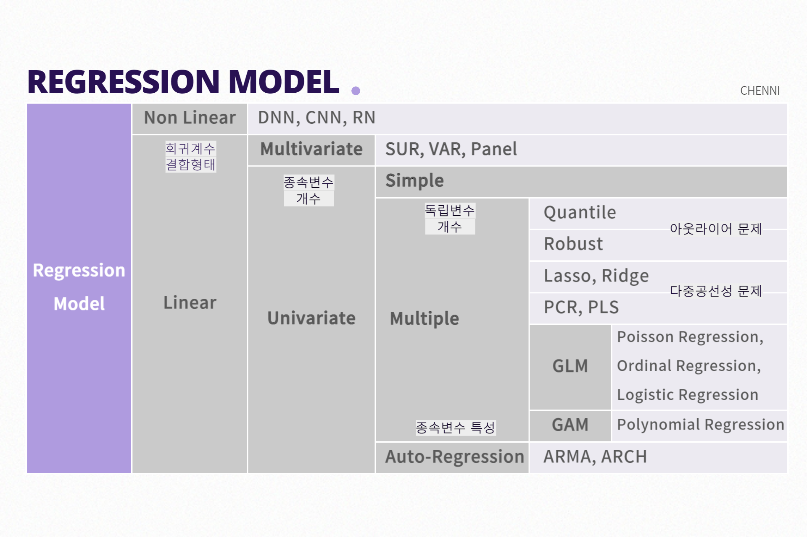

# 회귀분석

> Regression Analysis

[TOC]

**연속형 변수들에 대해 설명변수와 반응변수 사이의 함수적인 관계를 모형화하여 분석하는 통계적 기법**

- 변수들 사이의 관계, 관계의 정도, 관계식
- 관계식을 유도하여 독립변수의 변화에 따른 종속변수의 변화 예측
- 원하는 반응변수를 위한 설명변수의 값 조절

<br>

## 회귀 분석 모델



### 1-1. 선형 회귀분석

- 단순선형회귀: 하나의 예측변수

- 다중선형회귀: 두 개 이상의 예측변수

- 일변량 회귀: 하나의 양적 반응변수

- 다변량 회귀: 두 개 이상의 양적 반응변수

```
모형의 선형성, 오차의 등분산성/정규성/독립성, 설명변수 간의 독립성
```

<br>

### 1-2. 비선형 회귀분석

- **모형의 선형성 X 인 경우**
  - Polynomial Regression: 독립변수가 다항식으로 구성되는 회귀모델
  - GAM(Generalized Additive Model): 독립변수를 다른 함수의 선형 결합으로 표현
- **오차항의 정규성  X 인 경우**
  - Posisson Regression, Ordinal Regression, Logistic Regression 
  - GLM(Generalized Linear Model): 종속변수에 적절한 함수를 적용하는 회귀 모델링 기법
- **오차항의 독립성 X 인 경우**
  - Auto Regression: 주기성이나 계절성 등의 일정한 패턴이 있는 자기 상관성을 가진 회귀모델
- **설명변수 간의 독립성 X (다중공선성) 인 경우**
  - Ridge, Lasso, Elastic Net Regression: regularization을 이용한 회귀 모델링 기법
  - Principal Component Regression (PCR), Partial Least Square (PLS) Regression: 독립변수들의 주성분을 추출한 후 이 주성분을 이용해서 회귀 모델을 만드는 기법 (독립변수의 분산 최대로 하는 축 / 종속변수와 독립변수의 관계를 잘 설명하는 축)
- **데이터에 아웃라이어가 있는 경우**
  - Robust Regression: 잔차의 제곱 대신 절대값의 합이 최소가 되도록 계수 추정
  - Quantile Regression: 종속변수의 평균이 아니라 특정 분위값을 추정

<br>

<br>

## 회귀 성능 평가

실제값에 얼마나 가깝게 예측했는지

- 평균제곱오차 MSE ▼

- 평균제곱근오차 RMSE ▼

- R Squared ▲
