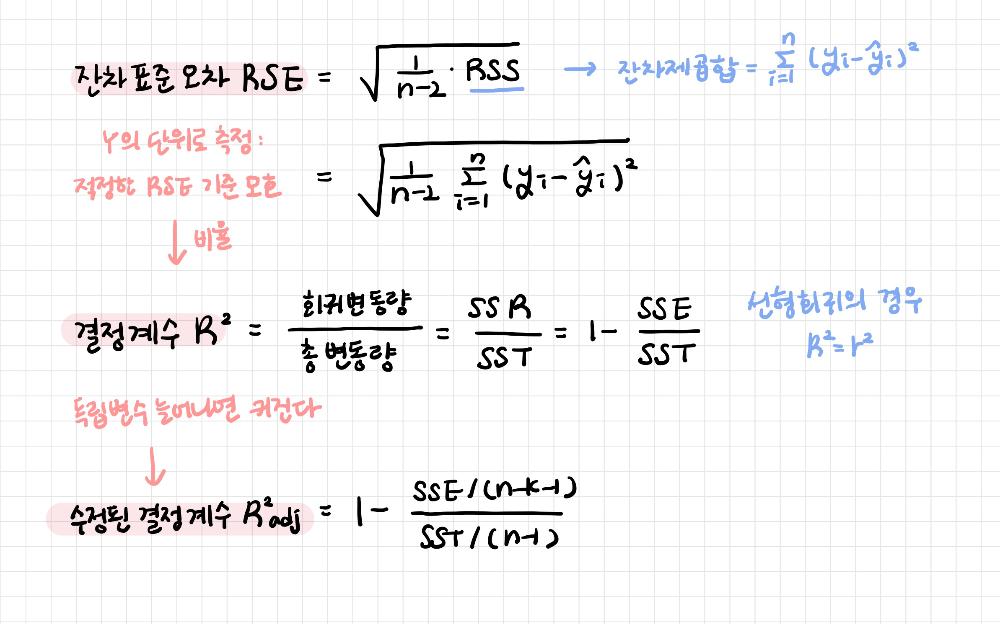
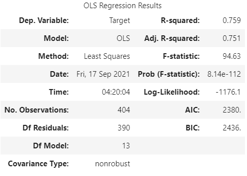

# 회귀 모델 성능 평가

> 실제 값과 회귀 예측 값의 차이를 기반으로 평가: 귀무가설을 기각하고 대립가설을 채택했다면 모델이 데이터에 적합한 정도를 평가해야한다

[TOC]

- **편차 (bias)**: 관측치가 평균으로부터 떨어져있는 정도, 평균과의 차이

- **오차 (Error)**: 모집단에서 얻은 회귀식으로 예측을 수행했을 때 실제 값과 예측 값의 차이

- **잔차 (Residual)**: 모집단에서 추출한 표본 집단에서 얻은 회귀식으로 예측을 수행했을 때 실제 값 (표본집단의 값)과 예측 값의 차이

  ▶ 추정된 값이 설명할 수 없어서 아직 남아있는 편차

<br>

## 1. 손실 함수

> Loss Function

예측 값이 실제 값과 얼마나 유사한지를 판단하는 기준

- 모델 성능의 '나쁨'을 나타내는 지표

- **손실 (Loss)**: 예측 값과 실제 값의 차이



<br>

### 1-1. MAE

> Mean Absolute Error: 평균 절대 오차

실제 값과 예측 값의 차이를 절대값으로 변환해 평균한 것

- 작을수록 좋지만, 과대적합이 될 수 있음에 주의

- 아웃라이어에 Robust하다: 아웃라이어에 대한 저항도 가지고 있고 데이터 특성도 잘 나타낸다
- 절대값이므로 underperformance인지, overperformance인지 알 수 없다
- 스케일에 의존적


<br>

### 1-2. MSE

> Mean Squared Error: 평균 제곱 오차

실제 값과 예측 값의 차이를 제곱해 평균한 것

- 아웃라이어에  민감하다
- MSE 오차가 작을수록 좋지만, 과대적합이 될 수 있음에 주의


<br>

### 1-3. RMSE

> Root Mean Squared Error: 평균 제곱근 오차

MSE는 오류의 제곱을 구하므로 실제 오류 평균보다 커지는 특성

MSE에 루트를 씌운 값: 예측값과 실제값의 차이에 대한 제곱에 대하여 평균을 낸 뒤 루트를 씌운 값

- 제곱 오차에 대한 왜곡을 줄여주는 효과
- MSE의 장단점 거의 유사


<br>

### 1-4. RMSLE

> Root Mean Squared Log Error

RMSE에 로그를 적용한 값

- 아웃라이어에 Robust하다: 아웃라이어가 있어도 변동폭이 크지 않다
- 상대적 Error 측정
- Under Estimation에 큰 패널티: 예측값이 실제값보다 작을 때 패널티


<br>

### 1-5. RSE

> Residual Standard Error: 잔차표준오차 

 실제 값이 추정한 회귀선으로부터 얼마나 벗어날지에 대한 평균값

- 적합성 결여 (lack of fit)의 판단 기준
- 오차항의 표준편차에 대한 추정값
- 반응변수 값이 실제 회귀선으로부터 벗어나게 될 평균값
- 평균제곱오차와 동일하지만 자유도에 따라 보정된 값

```
RSE가 작으면 모델이 데이터를 잘 적합한다는 의미
RSE가 크면 모델이 데이터를 잘 적합하지 않는다는 의미
```

<br>

---

<br>

## 2. R Square (R2)

> Coefficient of Determination, 결정계수

예측한 모델이 얼마나 실제 데이터를 설명하는지

- 모델의 적합성 (goodness of fit) 판단 기준
- 분산 기반으로 예측 성능 평가
  - 실제 값의 분산 대비 예측 값의 분산 비율
  - 설명된 분산의 비율: 회귀 모델이 데이터를 얼마나 잘 설명해주느냐를 나타내는 측도
  - 설명력: 전체 변동 중 회귀 직선에 의해 설명할 수 있는 변동이 차지하는 비율

```
R^2이 1에 가까울수록 추정된 회귀식이 총변동량의 많은 부분 설명한다는 의미
R^2이 0에 가까울수록 추정된 회귀식이 총변동량을 적절하게 설명하지 못한다는 의미
R^2이 음수가 나오면 잘못 평가 되었음을 의미
```

- scale에 관계 없는 상대적 성능


<br>

---

<br>

## 회귀 모형 평가

| <br> |  |
| ------------------------------------------------------------ | ------------------------------------------------------------ |

<br>

### 회귀모형의 타당성

```
귀무가설 H0: 회귀모형은 타당하지 않다.
대립가설 H1: 회귀모형은 타당하다.
```

- F-statistic : 검정통계량 = 81.49
- Prob (F-statistic) : P-value = 1.80e-102 < 0.05

<br>

### 변수들의 유의성

```
귀무가설 H0: X는 Y에 영향을 주지 않는다. (b = 0)
대립가설 H1: X는 Y에 영향을 준다.
```

- INDUS의 P-value = 0.944 > 0.05
- AGE의 P-value = 0.267 > 0.05

▶ INDUS와 AGE 변수를 제외한 나머지 독립변수들은 종속변수인 주택 가격에 유의한 영향을 준다고 볼 수 있다.

<br>

### 변수들의 영향

- 회귀계수의 값이 크면 X가 Y에 많은 영향을 준다.
- 회귀계수의 값이 작으면 X가 Y에 작은 영향을 준다.
- 회귀계수의 부호가 +이면 X가 Y를 증가시키는 영향을 준다.
- 회귀계수의 부호가 -이면 X가 Y를 감소시키는 영향을 준다.

<br>

### 회귀모형의 설명력

```
종속변수 Y의 변동을 회귀모형이 얼마나 설명하고 있는가?
종속변수 Y의 변동을 X가 얼마나 설명하고 있는가?
```

- R-squared = 0.0731

- Adj. R-squared = 0.722

▶ 회귀모형이 종속변수의 변동을 약 72.2% 정도 설명하고 있다.

<br>

### 회귀모형의 적합도

- MSE = 30.73

▶ 0에 가까울수록 적합도가 높다.

<br>

### 다중공선성

▶ VIF 값이 10 이상인 경우 독립변수들을 바꿔가며 유의미한 값을 도출해야한다 

<br>

### 오차의 정규성

```
귀무가설 H0: 정규분포를 따른다.
대립가설 H1: 정규분포를 따르지 않는다.
```

- Jarque-Bera Normality test: Jarque-Bera (JB) = 710.082
- Prob(JB) = 6.42e-155 < 0.05

▶ 귀무가설을 기각하여 정규성 가정을 만족시키지 못한다.

<br>

### 오차의 독립성

```
귀무가설 H0: 오차가 독립이다.
대립가설 H1: 오차가 독립이 아니다.
```

- Durbin-Watson = 1.980

▶ Durbin-Watson 값이 2에 가까우므로 오차들은 독립이다.

> Durbin-Watson 값이 0에 가까우면 양의 자기상관
>
> Durbin-Watson 값이 4에 가까우면 음의 자기상관