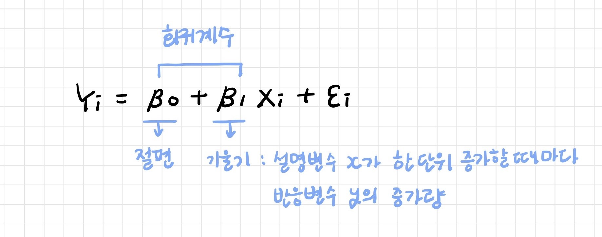
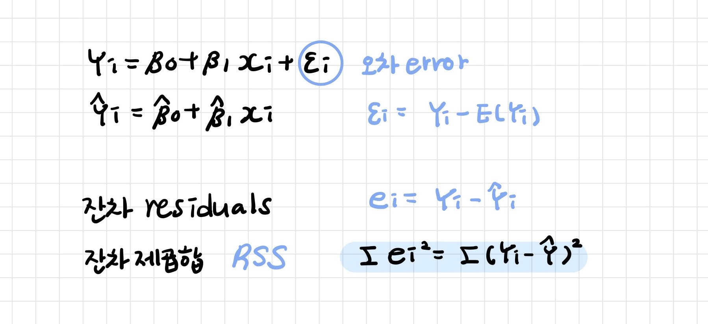
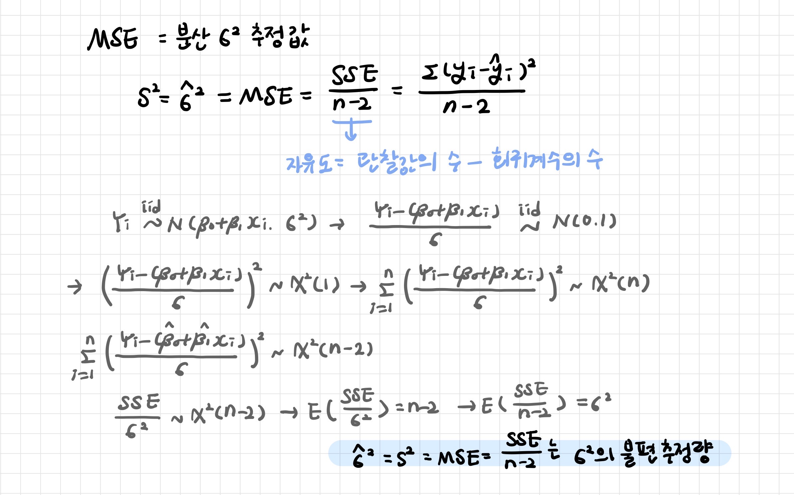
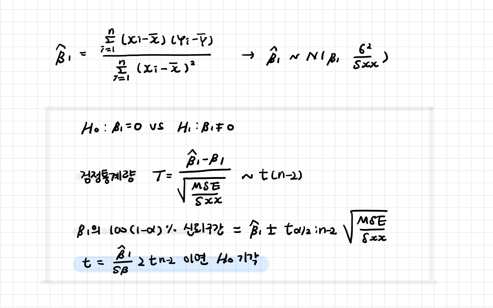

# 단순 선형 회귀

> Simple Linear Regression

**하나의 독립변수로 종속변수를 설명**

[TOC]



<br>

---

<br>

## 1. 회귀 모형 생성

### 1-1. 계수 추정

**최소제곱추정법 (LSE; Least Square Estimation Method)**

오차의 제곱 합이 최소가 되도록 회귀 계수를 추정하는 방법


<br>

### 1-2. 선형 회귀 결과

- **적합된 값** `fitted(model)`: 모델에 의해 예측된 값
- **회귀계수의 신뢰구간** : t 분포를 사용한 신뢰구간
- **잔차 (residuals)**: 모델로부터 구한 예측값과 실제 값 사이의 차이
- **잔차 제곱 합 (RSS; Residual Sum of Square)** : 실제 데이터와 선형 회귀 모델의 적합된 값의 차이의 제곱 합 → 데이터와 추정된 모델 간의 불일치 정도



<br>

---

<br>

## 2. 일원분산분석 ANOVA 

### 2-1. 분산분석

> 제곱합 분해 Decomposition / 분산분석

- **SST (Total Sum of Square)**: 총 제곱합

- **SSR (Regression Sum of Square)**: 회귀 제곱합

- **SSE (Error Sum of Square)**: 오차 제곱합

| 변동요인 | 제곱합 (SS) | 자유도 | 평균제곱 (MS)     | 검정 통계량   |
| -------- | ----------- | ------ | ----------------- | ------------- |
| **회귀** | SSR         | 1      | MSR = SSR / 1     | F = MSR / MSE |
| **잔차** | SSE         | n-2    | MSE = SSE / (n-2) |               |
| **합계** | SST         | n-1    |                   |               |




<br>

### 2-2. 회귀 모형 검정: F 검정

> 두 모집단의 분산의 차이가 있는지 검정

**회귀계수(기울기) 유의성 검정**

- F 통계량 = `표본 평균 간의 변동 (MSR) / 표본 내부의 변동 (MSE)`

- F 통계량이 큰 경우
  - 두 집단 간 분산의 차이가 존재한다는 것 의미
  - MSR > MSE: 평균들의 차이가 많이 난다는 것 ▶ 귀무가설 기각

```
귀무가설 H0: 두 모집단의 평균이 같다 (b1 = 0)
```


<br>

---

<br>

## 3. 회귀 모형 검정: t 검정

> 모집단의 분산이나 표준편차를 알지 못할 때 모집단을 대표하는 표본으로부터 추정된 분산이나 표준편차로 검정

**회귀계수(기울기) 유의성 검정**

```
귀무가설 H0: 두 모집단의 평균이 같다 (b1 = 0)
```

- t 통계량 = `표본평균사이의 차이 / 표준오차` = `두 집단의 차이의 평균(X)를 표준오차(SE)로 나눈 값`

- t 통계량이 기각역(t α,(n-1) 이상)에 존재하고 유의확률(P-value) < α (0.05): 두 집단 간 평균의 차이가 유의미하다는 것 의미 ▶ 귀무가설 기각



<br>

---

<br>

## 4. 예측

### 4-1. 평균값 예측과 신뢰구간


<br>

### 4-2. 개별값 예측과 예측구간


