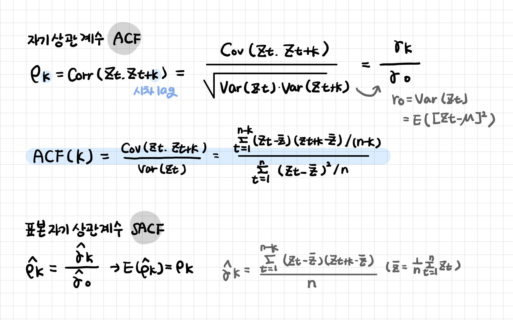
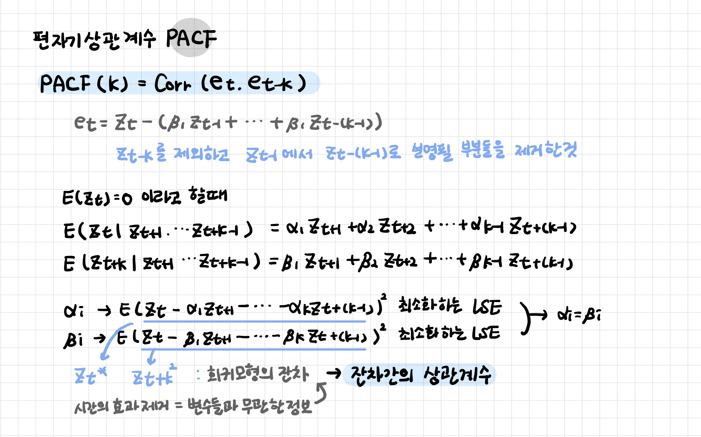

# 잔차진단

[TOC]

- 검증지표는 수치로 나오지만 잔차진단은 시각화로 확인한다

-  잔차가 패턴이 없다면 시계열 모델이 실제 데이터를 잘 적합했다고 판단할 수 있다: 잔차의 패턴이 없다는 것은 시계열 모델과 실제 데이터가 유사하다는 의미!

<br>

## 1. 백색 잡음

> White Noise

패턴이 남아있지 않은 무작위한 변동: 백색잡음은 추세나 계절성이 남아있지 않다는 것을 의미한다


- 평균 0 과 일정한 분산을 가진 정규분포를 따라야한다
- 잔차들이 시간의 흐름에 따라 상관성이 없어야한다
  - 자기상관함수가 0인지 확인
  - 편자기상관함수 확인

<br>

---

<br>

## 2. 자기상관함수

> AutoCovariance Function

**시간에 따른 상관 정도를 나타내는 통계량**


**자기상관관계**: 현재의 상태가 과거와 미래에 밀접한 관련이 있는 관계

**자기상관도표 Correlogram**: 자기상관함수와 편자기상관함수 중 하나를 그래프로 표현한 것

- 어느 시점까지 데이터가 현재 시점에 영향을 주는지를 연산하는 함수: 동일한 변수를 시점을 달리하여 관측했을 때 시점에 따라 데이터 사이의 상호 연관관계가 나타나는지
- 시점 차이 lag 의 영향력 확인: 현 시점의 데이터와 시점 차이를 가지는 데이터를 비교하고 어떤 관계를 갖는지 확인

- AR, MA 모델 적합성에 필요한 함수 (절단값: 0으로 수렴하는 시점)


<br>

### 2-1. 자기상관함수

>  AutoCorrelation Funtion: ACF

**시차에 따른 자기상관: Zt와 Zt+k사이의 correlation 측정**



- k가 커짐에 따라 / 시차가 커짐에 따라 ACF(k)값은 작아진다
  - 정상시계열: 빠르게 0에 수렴
  - 비정상시계열: 천천히 감소

<br>

### 2-2. 편자기상관함수

> Partial Autocorrelation Functio: PACF

**시차에 따른 일련의 편자기상관: Zt와 Zt+k사이의 correlation 측정하되 t와 t+k 사이에 다른 y값들의 영향력을 배제하고 측정**



- 시차가 다른 두 시계열 데이터의 순수한 상호 연관성
- 시간의 효과 제거: 시간이 효과인 추세 제거!
- k 시간 다뉘로 구분된 시계열의 관측치 간의 상관 측도

<br>

---

<br>

## 3. 정상성 검정

**ADF 검정 Augmented Dickey Fuller Test**

```
H0: 데이터는 비정상성이다 (단위근이 존재한다)
H1: 데이터가 정상성을 만족한다 (단위근이 존재하지 않는다)
```

ARIMA 모형의 적분 차수 판단에 사용된다

- 검정 통계량 ADF Statistics가 Critical Value보다 작으면 정상성 시계열 데이터

- P-value가 신뢰수준 값보다 작으면 정상적 시계열 데이터 


<br>

---

<br>

## 4. 정규성 검정

**Shapiro Wilk Test**

```
H0: 데이터는 정규분포 형태이다
H1: 데이터는 정규분포 형태가 아니다
```

- 검정 통계량이 Critical Value보다 크면 정규분포 형태

- P-value가 신뢰수준 값보다 크면 정규분포 형태

<br>

---

<br>

## 5. 자기상관 검정

**Ljung Box Test**

```
H0: 시계열 데이터의 자기상관이 존재하지 않는다 (자기상관계수 = 0)
H1: 시계열 데이터의 자기상관이 존재한다 (자기상관계수 != 0)
```

- 검정 통계량이 Critical Value보다 크면 자기상관 존재하지 않음

- P-value가 신뢰수준 값보다 크면 자기상관 존재하지 않음

**Durbin Watson Statistic**

```
H0: 시계열 데이터의 자기상관이 존재하지 않는다 (자기상관계수 = 0)
H1: 시계열 데이터의 자기상관이 존재한다 (자기상관계수 != 0)
```

- 검정 통계량이 2에 근접: 시계열 데이터에 자기상관 존재하지 않음
- 검정 통계량이 0에 근접: 시계열 데이터에 양의 자기상관 존재
- 검정 통계량이 4에 근접: 시계열 데이터에 음의 자기상관 존재

<br>

---

<br>

## 6. 등분산성 검정

**Goldfeld Quandt Test**

```
H0: 시계열 데이터가 등분산이다
H1: 시계열 데이터가 등분산이 아니다
```

- 검정 통계량이 Critical Value보다 크면 등분산

- P-value가 신뢰수준 값보다 크면 등분산

